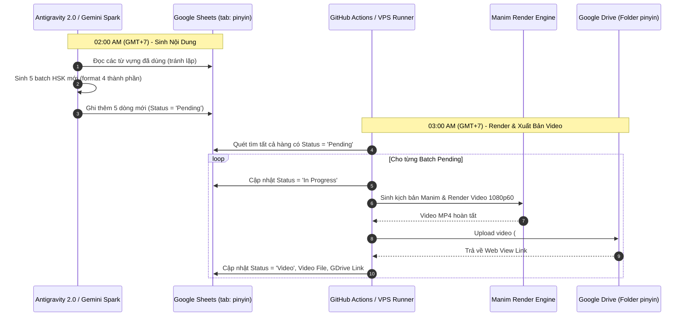

# 📋 TÀI LIỆU BÀN GIAO TOÀN BỘ DỰ ÁN (PROJECT HANDOFF)
**Kênh:** Lê Lệ Học Tiếng Trung (`lelehoctiengtrung`)  
**Ngày cập nhật:** 17/08/2026  
**Trạng thái hệ thống:** Sẵn sàng vận hành (Production Ready)

---

## 📑 MỤC LỤC
1. [Tổng Quan Dự Án & Mục Tiêu](#1-tổng-quan-dự-án--mục-tiêu)
2. [Kiến Trúc Đa Phân Hệ (Multi-Module Architecture)](#2-kiến-trúc-đa-phân-hệ-multi-module-architecture)
3. [Chi Tiết Phân Hệ Pinyin Quiz (`pinyinquiz/`)](#3-chi-tiết-phân-hệ-pinyin-quiz-pinyinquiz)
4. [Hệ Thống Dữ Liệu & Lưu Trữ Đám Mây](#4-hệ-thống-dữ-liệu--lưu-trữ-đám-mây)
5. [Quy Trình Tự Động Hóa 24/7 (Automation Workflow)](#5-quy-trình-tự-động-hóa-247-automation-workflow)
6. [Sơ Đồ Cấu Trúc File & Thư Mục](#6-sơ-đồ-cấu-trúc-file--thư-mục)
7. [Sổ Tay Vận Hành & Lệnh CLI (Runbook)](#7-sổ-tay-vận-hành--lệnh-cli-runbook)
8. [Bảo Mật & Quản Lý Khóa API (Security & Secrets)](#8-bảo-mật--quản-lý-khóa-api-security--secrets)
9. [Lộ Trình Mở Rộng Các Hạng Mục Tiếp Theo](#9-lộ-trình-mở-rộng-các-hạng-mục-tiếp-theo)

---

## 1. 🎯 Tổng Quan Dự Án & Mục Tiêu

Dự án **Lê Lệ Học Tiếng Trung Content Automation Hub** là một hệ sinh thái tự động hóa toàn diện nhằm sản xuất nội dung video ngắn chất lượng cao phục vụ các kênh mạng xã hội: **TikTok**, **YouTube Shorts**, và **Facebook Reels**.

Hệ thống được thiết kế theo tư duy **Zero-Touch Automation**:
- Tự động sinh ý tưởng nội dung từ vựng HSK.
- Tự động tạo kịch bản video hoạt họa động sắc nét (Manim Engine).
- Tự động phát âm chuẩn tiếng Trung bản xứ (Microsoft Edge TTS AI) kết hợp âm thanh đếm ngược và chuông báo.
- Tự động kết xuất video chuẩn định dạng dọc 9:16 (1080x1920@60fps).
- Tự động tải video lên Google Drive và đồng bộ trạng thái, liên kết lên Google Sheets.

---

## 2. 🏗️ Kiến Trúc Đa Phân Hệ (Multi-Module Architecture)

Để phục vụ kế hoạch phát triển nhiều định dạng nội dung khác nhau cho kênh Lê Lệ Học Tiếng Trung, dự án được quy hoạch theo mô hình phân hệ độc lập (Modular Monorepo):

```
lelehoctiengtrung/
├── pinyinquiz/                  # Phân hệ 1: Video đố vui Pinyin & Hán tự HSK
├── .github/workflows/          # CI/CD tự động hóa toàn cục
├── .venv/                      # Python Virtual Environment dùng chung
├── requirements.txt            # Thư viện dùng chung
├── README.md                   # Tài liệu tổng quan dự án
└── HANDOFF.md                  # Tài liệu bàn giao toàn diện này
```

Mỗi phân hệ (như `pinyinquiz/`) là một gói phần mềm độc lập, có cấu hình, assets, scripts và tài liệu riêng, không gây xung đột với các phân hệ khác.

---

## 3. 🎬 Chi Tiết Phân Hệ Pinyin Quiz (`pinyinquiz/`)

### 3.1. Thiết Kế Visual & Storyboard (Chuẩn TikTok 9:16)
- **Độ phân giải:** `1080 x 1920` (Tỷ lệ 9:16 dọc), 60 FPS (khi render sản xuất) hoặc 15 FPS (khi preview nhanh).
- **Background:** Vũ trụ điện ảnh huyền ảo kết hợp lớp phủ Dark Glassmorphism sang trọng.
- **Thẻ câu đố (Main Question Card):**
  - Chữ Hán to rõ ở vị trí trung tâm, font chuẩn chữ viết.
  - Nghĩa tiếng Việt trong ngoặc font Arial rõ nét.
  - Pinyin ẩn hiển thị chữ cái đầu của từng âm tiết (`p _ _ _   g _ _`).
  - Đồng hồ đếm ngược 5 giây (`TIME 5..4..3..2..1`) đi kèm thanh chạy ngang đổi màu (Xanh dương $\rightarrow$ Đỏ cảnh báo khi $\le 2s$).
- **Mở đáp án (Reveal State):**
  - Hết 5 giây: Phát tiếng chuông Ding thanh khiết.
  - Pinyin ẩn phóng to và biến đổi mượt sang Pinyin đầy đủ có dấu (`píng guǒ`).
  - Kích hoạt giọng đọc phát âm chuẩn tiếng Trung.
  - Giữ lại 2 giây cho người xem lắng nghe và nhẩm theo.
- **Màn hình kêu gọi hành động (End Screen CTA):**
  - Thẻ tổng kết: *"BẠN ĐOÁN ĐÚNG MẤY CÂU? - Comment số điểm bên dưới nhé! 👇 - Follow kênh lelehoctiengtrung để luyện tập mỗi ngày! ✨"*.

### 3.2. Động Cơ Xử Lý Âm Thanh & Ngôn Ngữ
- **Pinyin Engine (`pinyin_utils.py`):** Sử dụng `pypinyin` phân tích cú pháp Hán tự, tự động gán dấu thanh điệu và tạo mặt nạ gạch dưới theo chuẩn yêu cầu.
- **Edge-TTS AI (`audio_generator.py`):** Tích hợp giọng đọc bản xứ cao cấp `zh-CN-XiaoxiaoNeural`, tự động lưu cache âm thanh để tái sử dụng, tối ưu tốc độ render.
- **Math Synthesizer Sound:** Tạo sóng âm thanh chuông Ding Crystal Chime và tiếng gõ tích tắc trực tiếp bằng thuật toán toán học `numpy` & `scipy`, không lẫn tạp âm môi trường.

---

## 4. ☁️ Hệ Thống Dữ Liệu & Lưu Trữ Đám Mây

### 4.1. Google Sheets (Cơ sở dữ liệu quản lý)
- **Spreadsheet ID:** `1b6LNl7JHRiCsjK1w9VuD86GLqAfmSOtDUOm5whrGdH0`
- **Tab Quản lý:** `pinyin`
- **Cấu trúc 16 Cột Chuẩn (Đồng bộ với hệ sinh thái LeLe):**

| Cột | Tên Cột | Mô Tả & Ví Dụ |
| :--- | :--- | :--- |
| **A** | `#` | Số thứ tự batch (1, 2, 3...) |
| **B** | `Topic` | Tên chủ đề (VD: `HSK 1 • Đồ Ăn & Thức Uống`) |
| **C** | `Level` | Cấp độ HSK (`HSK 1`, `HSK 2`, `HSK 3`) |
| **D** | `Status` | Trạng thái: `Pending` $\rightarrow$ `In Progress` $\rightarrow$ `Video` / `Failed` |
| **E** | `Word 1` | `苹果 \| píng guǒ \| p _ _ _   g _ _ \| Quả táo` |
| **F** | `Word 2` | `米饭 \| mǐ fàn \| m _   f _ _ \| Cơm` |
| **G** | `Word 3` | `面包 \| miàn bāo \| m _ _ _   b _ _ \| Bánh mì` |
| **H** | `Word 4` | `喝水 \| hē shuǐ \| h _   s _ _ _ \| Uống nước` |
| **I** | `Word 5` | `吃饭 \| chī fàn \| c _ _   f _ _ \| Ăn cơm` |
| **J** | `metadata` | Link Google Drive chứa file metadata (Title + Description cho YT Shorts, TikTok, FB Reels) |
| **K** | `Video` | Đường dẫn trực tiếp file video trên Google Drive sau khi render xong |
| **L** | `Youtube` | Trạng thái / Link video khi đăng YouTube Shorts |
| **M** | `Tiktok` | Trạng thái / Link video khi đăng TikTok |
| **N** | `Facebook` | Trạng thái / Link video khi đăng Facebook Reels |
| **O** | `Created At` | Ngày giờ tạo dữ liệu (`YYYY-MM-DD HH:MM:SS`) |
| **P** | `Notes` | Ghi chú nguồn tạo batch |

### 4.2. Google Drive (Kho lưu trữ video & metadata)
- **Target Folder ID:** `1Y240J5-oXA-UDm2IKvp7qCBVsRempbCB`
- **Phương thức tải lên:** Hỗ trợ ưu tiên **Google OAuth 2.0** kết hợp fallback sang **Google Cloud Service Account**.
- **File Video:** `#{Số dòng}.{Tên topic}.mp4`
- **File Metadata:** `#{Số dòng}.{Tên topic}_metadata.txt` (Chứa sẵn Title, Description, Caption & Hashtags tối ưu cho YouTube Shorts, TikTok, Facebook Reels)

---

## 5. 🔄 Quy Trình Tự Động Hóa 24/7 (Automation Workflow)



---

## 6. 📂 Sơ Đồ Cấu Trúc File & Thư Mục

```
/media/vpsg16gb/HaRiDisk/CHANNELS/lelehoctiengtrung/
│
├── 📂 pinyinquiz/                          # Module Pinyin Quiz
│   ├── 📂 assets/
│   │   ├── 📂 images/
│   │   │   ├── background.jpg             # Ảnh nền video dọc 1080x1920
│   │   │   └── logo.png                   # Logo kênh Lê Lệ Học Tiếng Trung
│   │   └── 📂 audio/
│   │       ├── bell.mp3                   # Chuông ding báo đáp án
│   │       ├── tick.mp3                   # Tiếng tích tắc đếm ngược
│   │       └── 📂 words/                  # Cache các file mp3 giọng đọc TTS
│   ├── 📂 configs/                        # Thư mục cấu hình (được gitignore bảo vệ)
│   │   ├── oauth_credentials.json         # Client ID, Secret, Refresh Token
│   │   └── service_account.json           # Google Cloud Service Account
│   ├── 📂 data/
│   │   └── sample_words.json              # Dữ liệu từ vựng mẫu dự phòng
│   ├── 📂 output/
│   │   ├── 📂 generated_scenes/           # Code Python Manim sinh tự động
│   │   ├── 📂 media/                      # Cache render trung gian của Manim
│   │   └── 📂 videos/                     # Video MP4 thành phẩm đã render
│   ├── 📂 scripts/
│   │   ├── run_batch.py                   # Script chính: Quét sheet, render & upload
│   │   ├── generate_daily_batches.py      # Script sinh 5 batch từ vựng vào sheet
│   │   ├── create_sheet_tab.py            # Script khởi tạo tab 'pinyin'
│   │   ├── populate_sample_batches.py     # Script nạp dữ liệu mẫu ban đầu
│   │   └── get_oauth_token.py             # Tool lấy Refresh Token Google Drive
│   ├── 📂 src/
│   │   ├── config.py                      # Cấu hình toàn cục module
│   │   ├── pinyin_utils.py                # Xử lý Pinyin & mặt nạ gạch dưới
│   │   ├── audio_generator.py             # Sinh âm thanh & Microsoft Edge TTS
│   │   ├── scene_generator.py             # Trình sinh mã Manim scene
│   │   ├── render_engine.py               # Wrapper điều khiển Manim CLI
│   │   ├── gsheet_manager.py              # Đọc/ghi Google Sheets tab 'pinyin'
│   │   ├── gdrive_uploader.py             # Upload Google Drive API
│   │   └── template_quiz_scene.py         # Mẫu kịch bản Manim chuẩn
│   ├── tiktok_hsk.py                      # Kịch bản Manim độc lập để test
│   ├── requirements.txt                   # Danh sách thư viện Python của module
│   ├── README.md                          # Hướng dẫn chi tiết phân hệ
│   ├── scheduled task set up.md           # Hướng dẫn cài Scheduled Task Antigravity
│   └── spark_setup.md                     # Hướng dẫn cấu hình Agentic Spark
│
├── 📂 .github/workflows/
│   └── daily_render.yml                   # Workflow GitHub Actions chạy lúc 03:00 GMT+7
├── 📂 .venv/                              # Python Virtualenv
├── 📄 .gitignore                          # Cấu hình bỏ qua file nhạy cảm và cache
├── 📄 requirements.txt                    # Danh sách thư viện toàn cục
├── 📄 README.md                           # Tài liệu tổng quan kênh
└── 📄 HANDOFF.md                          # Tài liệu bàn giao này
```

---

## 7. 📖 Sổ Tay Vận Hành & Lệnh CLI (Runbook)

### 7.1. Chạy Thủ Công Trên VPS

```bash
# 1. Truy cập thư mục module Pinyin Quiz:
cd /media/vpsg16gb/HaRiDisk/CHANNELS/lelehoctiengtrung/pinyinquiz

# 2. Kích hoạt môi trường ảo:
source ../.venv/bin/activate

# 3. Chạy render tất cả hàng 'Pending' trong Google Sheets và upload lên Google Drive:
PYTHONPATH=. python scripts/run_batch.py --from-sheet --quality qh --upload-gdrive

# 4. Render một hàng cụ thể theo ID (ví dụ: chỉ render hàng #3):
PYTHONPATH=. python scripts/run_batch.py --from-sheet --row-id 3 --quality qh --upload-gdrive

# 5. Sinh thêm 5 batch từ vựng mới vào Google Sheets:
PYTHONPATH=. python scripts/generate_daily_batches.py

# 6. Test render nhanh 1 video mẫu (chất lượng xem trước 480p):
manim -ql tiktok_hsk.py HSKQuiz --media_dir output/media
```

### 7.2. Vận Hành Tự Động Qua GitHub Actions

- **Repository:** `https://github.com/naadld/lele2vid.git`
- **Lịch chạy tự động:** `03:00 AM GMT+7` (tương đương `20:00 UTC` ngày hôm trước).
- **Chạy thủ công qua giao diện Web (Manual Trigger):**
  1. Vào tab **Actions** $\rightarrow$ chọn **Daily Pinyin TikTok Video Render**.
  2. Bấm nút **Run workflow**.
  3. Tùy chọn chất lượng: `qh` (1080p60) hoặc `ql` (480p test nhanh).
  4. (Tùy chọn) Điền `Row ID` nếu chỉ muốn render 1 hàng cụ thể.

---

## 8. 🔒 Bảo Mật & Quản Lý Khóa API (Security & Secrets)

### 8.1. Các Biến Môi Trường Cần Thiết Cho GitHub Actions:
Trong **GitHub Repository Settings** $\rightarrow$ **Secrets and variables** $\rightarrow$ **Actions**:

1. `GCP_SERVICE_ACCOUNT_JSON`: Nội dung file `service_account.json`.
2. `GDRIVE_CLIENT_ID`: Client ID OAuth 2.0 của tài khoản Google Drive.
3. `GDRIVE_CLIENT_SECRET`: Client Secret OAuth 2.0.
4. `GDRIVE_REFRESH_TOKEN`: Refresh Token OAuth 2.0 của tài khoản Google Drive.

### 8.2. Bảo Mật Cục Bộ Trên VPS:
- File `.gitignore` đã được cấu hình chặt chẽ để **không bao giờ commit** các file JSON chứa private key, credential, token hoặc file video/audio dung lượng lớn lên Git.

---

## 9. 🚀 Lộ Trình Mở Rộng Các Hạng Mục Tiếp Theo

Khi mở rộng thêm các nội dung mới cho kênh **Lê Lệ Học Tiếng Trung**, chỉ cần tạo các thư mục phân hệ mới ngang cấp với `pinyinquiz/`:

1. **`lelehoctiengtrung/dialogues/`**: Video hội thoại tiếng Trung tình huống thực tế 2 nhân vật hoạt họa.
2. **`lelehoctiengtrung/grammar/`**: Video phân biệt ngữ pháp & các cặp từ dễ nhầm lẫn (Ví dụ: 二 vs 两, 刚才 vs 刚).
3. **`lelehoctiengtrung/radicals/`**: Video học 214 bộ thủ tiếng Trung qua hình ảnh minh họa sinh động.
4. **`lelehoctiengtrung/karaoke/`**: Video bài hát tiếng Trung có sub chạy Karaoke pinyin & dịch nghĩa.

---

**Người thực hiện bàn giao:** Antigravity AI Coding Assistant  
**Đơn vị:** Hệ thống Sản xuất Nội dung Kỹ thuật số - Kênh Lê Lệ Học Tiếng Trung
