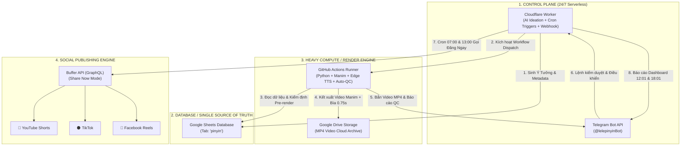
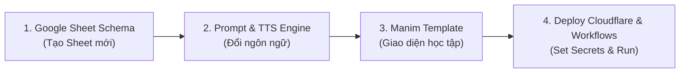

# 📘 TÀI LIỆU HANDOFF KỸ THUẬT TOÀN DIỆN (TECHNICAL HANDOFF)
## KIẾN TRÚC PIPELINE TỰ ĐỘNG HÓA SẢN XUẤT & XUẤT BẢN VIDEO ĐA NỀN TẢNG (24/7)
*Hệ thống chuẩn hóa cho Kênh "Lê Lê Học Tiếng Trung" và Cẩm nang mở rộng đa ngôn ngữ (Tiếng Anh, Tiếng Pháp)*

---

## 1. TỔNG QUAN KIẾN TRÚC HỆ THỐNG (SYSTEM ARCHITECTURE)

Hệ thống được thiết kế theo mô hình **Hoàn toàn Serverless & Tự trị (100% Cloud-native & Zero-VPS dependent)**, phối hợp nhịp nhàng giữa 6 nền tảng đám mây lớn:



---

## 2. 6 NỀN TẢNG THÀNH PHẦN VÀ VAI TRÒ CHI TIẾT

| Nền Tảng | Thành Phần Kỹ Thuật | Vai Trò & Trách Nhiệm Cốt Lõi |
| :--- | :--- | :--- |
| ☁️ **Cloudflare Workers** | `src/index.js`<br>`src/ai_ideation.js`<br>`src/buffer_publisher.js` | **Bộ não điều khiển 24/7:** Chạy cron tạo ý tưởng, xử lý Webhook bot Telegram, điều phối lệnh kết xuất qua GitHub API, quản lý Buffer Publishing và gửi Dashboard. |
| 📊 **Google Sheets** | `GoogleSheetsClient`<br>`pinyinquiz/data` | **Cơ sở dữ liệu trung tâm:** Lưu trữ toàn bộ kho ý tưởng, 5 từ vựng, Pinyin, nghĩa tiếng Việt, Social Metadata, link Google Drive, và trạng thái vòng đời. |
| ⚙️ **GitHub Actions** | `daily_render.yml`<br>`auto_qc.yml` | **Cỗ máy kết xuất đồ họa (GPU/CPU):** Manim Community Engine render video dọc 1080x1920, ghép phát âm Edge TTS, nhúng ảnh bìa 0.75s ở `00:00`, upload Drive và chạy Auto-QC. |
| 🤖 **Telegram Bot API** | `@lelepinyinBot`<br>`src/telegram.js` | **Giao diện Human-in-the-Loop:** Nhận video xem trực tiếp, cung cấp nút Approve/Reset/Delete 1-chạm, cảnh báo lỗi, gửi Dashboard tiến độ và nhận lệnh điều khiển. |
| 📁 **Google Drive API** | Service Account OAuth2 | **Kho lưu trữ Video vĩnh viễn:** Lưu các file `.mp4` chất lượng cao (1080p 60fps), tạo link tải trực tiếp (`drive.usercontent.google.com`) cho Buffer. |
| 🚀 **Buffer GraphQL API** | GraphQL Endpoint<br>`https://api.buffer.com` | **Cổng phân phối đa kênh:** Đăng video đồng thời lên YouTube Shorts, TikTok và Facebook Page với metadata và caption riêng biệt được định dạng tối ưu. |

---

## 3. QUY TRÌNH VÒNG ĐỜI NỘI DUNG (END-TO-END DATA LIFECYCLE)

```text
[Ý Tưởng AI] ➔ Pending ➔ [Pre-Render Gatekeeper] ➔ [Manim Render + Cover 0.75s] 
     ➔ Video ➔ [Auto-QC Gatekeeper] ➔ Ready ➔ [Buffer Publish 07:00 / 13:00] ➔ Published
```

### Bước 1: Sinh Ý Tưởng & Chống Trùng Lặp (Multi-AI Engine)
- **Cơ chế Failover 4 Tầng:** Google AI Studio (Gemini 2.5/2.0) ➔ Agnes AI (GPT-4o mini/DeepSeek) ➔ Cloudflare Workers AI (Llama 3.3 70B) ➔ Curated Vocab Bank (Kho mẫu tích hợp).
- **Luật Spaced Repetition:** Đọc lịch sử 50 từ và 10 chủ đề gần nhất trên Google Sheet, đảm bảo tối thiểu 4/5 từ là từ mới hoàn toàn.
- **Tạo Social Metadata tự động:** Sinh sẵn tiêu đề, mô tả YouTube Shorts, caption TikTok, caption Facebook Reels kèm Hashtag SEO chuẩn.

### Bước 2: Pre-render Gatekeeper (Xác thực dữ liệu)
- Kiểm tra 100% chữ Giản thể (chặn chữ Phồn thể).
- Kiểm tra số âm tiết Pinyin khớp 1-1 với chữ Hán (cách nhau bởi dấu cách).
- Kiểm tra độ dài nghĩa tiếng Việt (<= 30 ký tự để không tràn khung video).
- Nếu phát hiện lỗi: Đánh dấu `Status = Failed`, ghi chú nguyên nhân vào cột `Notes`, gửi cảnh báo về Telegram và chặn không cho render.

### Bước 3: Render Video Manim & Tích Hợp Ảnh Bìa 0.75s
- **Cơ chế Cover Frame `00:00`:** Tạo ảnh bìa 1080x1920 (bố cục 3 tầng tinh gọn, chữ to Gold 3D) và nhúng trực tiếp làm khung hình đầu tiên của video trong **0.75 giây**.
- **Lợi ích:** Các nền tảng (TikTok, YouTube Shorts, Reels) tự động bắt Frame 0 làm ảnh bìa lưới mà không cần tải file thumbnail rời lên Google Drive.
- Video được đẩy lên Google Drive và gửi nguyên file `.mp4` về Telegram cá nhân.

### Bước 4: Auto-QC Gatekeeper (Kiểm soát chất lượng tự động)
- Quét video: Độ tương phản khung hình 00:00 (Mean brightness, Standard deviation, độ ổn định 0.75s).
- Kiểm tra chữ Hán, phát âm và thời lượng video.
- Đạt chuẩn 100% ➔ Tự động duyệt dòng từ `Video` ➔ **`Ready`**.

### Bước 5: Đăng Video Tự Động (Publishing)
- Chạy vào **07:00 Sáng & 13:00 Chiều** hàng ngày.
- Lấy đúng 1 video `Ready`, gọi lệnh **Đăng Ngay (`Share Now`)** qua Buffer GraphQL API.
- Bắn thông báo chúc mừng kèm link bài đăng thực tế về Telegram.

---

## 4. MA TRẬN LỆNH ĐIỀU KHIỂN TELEGRAM BOT

| Lệnh | Ý Nghĩa Kỹ Thuật | Hành Động Thực Thi |
| :--- | :--- | :--- |
| **`/ideate`** | Sinh 1 bộ ý tưởng mới | Gọi Multi-AI, thêm dòng `Pending` vào Sheet, gửi tin nhắn kèm nút `[Render Ngay]` |
| **`/fix`** hoặc **`/heal`** | AI Auto-Healing | Quét các dòng `Failed`, tự động sửa Phồn thể ➔ Giản thể, chuẩn hóa Pinyin/Metadata ➔ Đổi sang `Pending` |
| **`/render [id]`** | Kích hoạt Render | Gọi GitHub Actions API dispatch workflow `daily_render.yml` |
| **`/resetall`** | Reset toàn bộ video | Đổi toàn bộ dòng `Video` về `Pending` để render lại mẻ video mới |
| **`/reset [id]`** | Reset 1 dòng cụ thể | Đổi dòng chỉ định về `Pending` |
| **`/approve [id]`** | Duyệt thủ công | Đổi trạng thái dòng sang `Ready` (Sẵn sàng đăng) |
| **`/qc`** | Kích hoạt Auto-QC | Kích hoạt GitHub Action `auto_qc.yml` quét và tự động duyệt video |
| **`/publish`** | Đăng 1 video ngay | Gọi Buffer API đăng ngay 1 video `Ready` (hoặc retry dòng `Error`) |
| **`/status`** hoặc **`/buffer`** | Xem Dashboard | Hiển thị Dashboard tiến độ kho, thanh đo Quota Buffer, trạng thái 3 kênh |
| **`/help`** | Menu hướng dẫn | Hiển thị danh sách lệnh và lịch hoạt động Cron 24/7 |

---

## 5. CẨM NANG NHÂN BẢN PIPELINE CHO ĐỊNH DẠNG & NGÔN NGỮ MỚI
*(Áp dụng cho: Tiếng Anh, Tiếng Pháp, Tiếng Trung Nâng Cao / Ngữ Pháp)*

Để nhân bản mô hình này sang một kênh ngôn ngữ mới (ví dụ: `LeLe Tiếng Anh` hoặc `LeLe Tiếng Pháp`), chỉ cần thực hiện 4 bước chuẩn hóa:



### Bước 1: Chuẩn hóa Schema Google Sheet
Cấu trúc chuẩn 16 cột (A ➔ P) cho mọi ngôn ngữ:
- **Cột A:** `ID` (1, 2, 3...)
- **Cột B:** `Topic` (Chủ đề bài học)
- **Cột C:** `Level` (A1, A2, B1, B2, C1 đối với Tiếng Anh/Pháp; HSK 1-6 đối với Tiếng Trung)
- **Cột D:** `Status` (`Pending` ➔ `Video` ➔ `Ready` ➔ `Published` / `Failed`)
- **Cột E ➔ I:** `Word 1` đến `Word 5` (Định dạng: `Từ Vựng | Phiên Âm IPA | Nghĩa Tiếng Việt`)
- **Cột J:** `Metadata` (Đoạn text chuẩn cho YouTube, TikTok, Facebook)
- **Cột K:** `Video_URL` (Link Google Drive)
- **Cột L, M, N:** `YT_Status`, `TT_Status`, `FB_Status`
- **Cột O:** `Created_At`
- **Cột P:** `Notes` (Ghi chú lỗi của Gatekeeper / Auto-QC)

### Bước 2: Cấu hình TTS (Text-to-Speech) & Audio
Tận dụng thư viện mã nguồn mở chất lượng cao `edge-tts`:
- **Tiếng Trung (Giản thể):** `zh-CN-XiaoxiaoNeural` hoặc `zh-CN-YunxiNeural`
- **Tiếng Anh (US/UK):** `en-US-JennyNeural`, `en-US-GuyNeural`, `en-GB-SoniaNeural`
- **Tiếng Pháp (France):** `fr-FR-DeniseNeural`, `fr-FR-HenriNeural`

### Bước 3: Điều chỉnh Manim Video Template (`scene_generator.py`)
- **Tiếng Trung:** Hiển thị 3 tầng (Chữ Hán ➔ Pinyin có che đố vui ➔ Nghĩa tiếng Việt).
- **Tiếng Anh:** Hiển thị 3 tầng (Từ vựng tiếng Anh ➔ Phiên âm IPA quốc tế `[ /.../ ]` ➔ Nghĩa tiếng Việt + Ví dụ ngắn).
- **Tiếng Pháp:** Hiển thị 3 tầng (Từ vựng kèm giống `un / une / le / la` ➔ Phiên âm IPA ➔ Nghĩa tiếng Việt).

### Bước 4: Tùy biến AI System Prompt theo Ngôn Ngữ
Trong `cloudflare/src/ai_ideation.js`:
```javascript
// Ví dụ Prompt cho Tiếng Anh (English Vocabulary Quiz):
function buildEnglishSystemPrompt(history, count) {
  return `Bạn là chuyên gia sư phạm tiếng Anh cho kênh "LeLe Learn English".
Nhiệm vụ: Tạo ${count} bộ chủ đề từ vựng tiếng Anh (Oxford 3000 / IELTS / Giao tiếp).
Quy tắc:
1. Mỗi bộ gồm đúng 5 từ vựng.
2. Phiên âm chuẩn IPA quốc tế (ví dụ: 'schedule' -> '/ˈʃedʒ.uːl/').
3. Nghĩa tiếng Việt ngắn gọn dưới 30 ký tự.
4. Cấp độ: A1, A2, B1, B2, C1.`;
}

// Ví dụ Prompt cho Tiếng Pháp (Vocabulaire Français):
function buildFrenchSystemPrompt(history, count) {
  return `Bạn là giáo viên tiếng Pháp cho kênh "LeLe Apprendre le Français".
Nhiệm vụ: Tạo ${count} bộ từ vựng tiếng Pháp (DELF A1 - B2).
Quy tắc:
1. Danh từ bắt buộc có mạo từ đi kèm để phân biệt giống đực/cái (un/une/le/la).
2. Phiên âm IPA chuẩn xác tiếng Pháp.
3. Nghĩa tiếng Việt súc tích dưới 30 ký tự.`;
}
```

---

## 6. DANH MỤC BIẾN MÔI TRƯỜNG & SECRETS (SECURITY CHEATSHEET)

| Tên Secret / Biến | Vị trí cấu hình | Mục đích sử dụng |
| :--- | :--- | :--- |
| `TELEGRAM_BOT_TOKEN` | GitHub Secrets + Cloudflare Secret | Token bot kết nối Telegram Bot API (`wrangler secret put TELEGRAM_BOT_TOKEN`) |
| `TELEGRAM_CHAT_ID` | `wrangler.toml` + GitHub Secrets | Chat ID cá nhân/nhóm nhận thông báo (`1187577977`) |
| `GCP_SERVICE_ACCOUNT_JSON` | GitHub Secrets | Toàn bộ nội dung JSON Service Account điều khiển Google Sheet & Google Drive |
| `GDRIVE_CLIENT_ID` / `SECRET` / `REFRESH_TOKEN` | GitHub Secrets | OAuth2 credentials tải video lên Google Drive |
| `BUFFER_ACCESS_TOKEN` | Cloudflare Secret | Token xác thực Buffer GraphQL API để xuất bản video đa kênh |
| `GITHUB_TOKEN` | Cloudflare Secret | Personal Access Token (`repo`, `workflow`) để Cloudflare kích hoạt GitHub Actions |
| `GEMINI_API_KEYS` | Cloudflare Secret | Danh sách các API Key Google AI Studio xoay vòng để sinh ý tưởng |

---

## 7. KẾT LUẬN & TRẠNG THÁI BÀN GIAO
- ✅ Toàn bộ hệ thống pipeline của Kênh **Lê Lê Học Tiếng Trung** đã được chuẩn hóa 100%, kết nối tự động khép kín.
- ✅ Video được tích hợp ảnh bìa Cover 0.75s tại `00:00:00`.
- ✅ Lịch trình Cron 24/7 tự động (01:00 sản xuất, 06:30 Auto-QC, 07:00 đăng video, 12:01 Dashboard, 12:30 Auto-QC, 13:00 đăng video, 18:01 Dashboard).
- ✅ Hệ sinh thái sẵn sàng nhân bản tức thì sang các format mới (Tiếng Anh, Tiếng Pháp, Ngữ pháp nâng cao).
