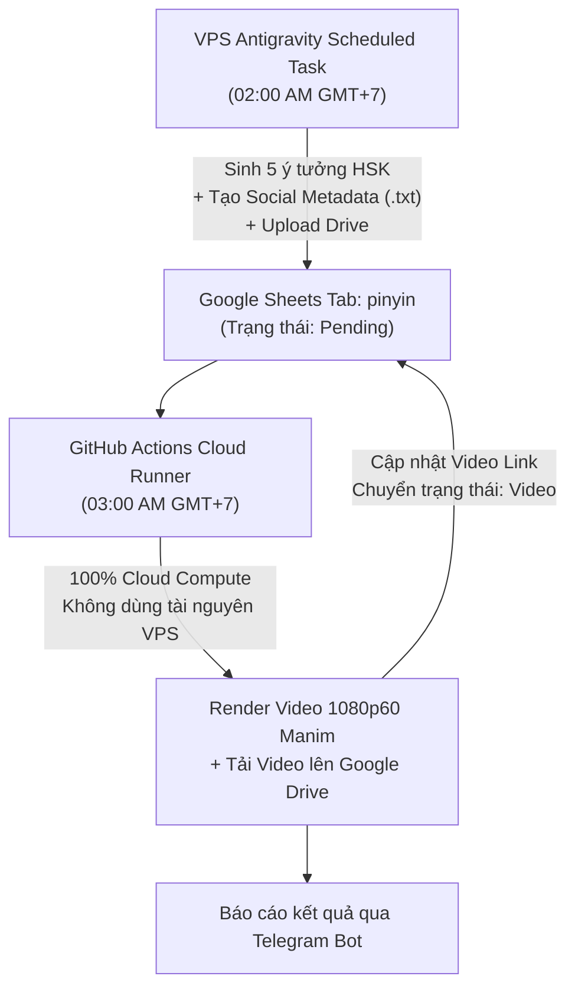

# ⏰ Hướng Dẫn Setup Scheduled Task Trên Antigravity 2.0 (Máy VPS)

Tài liệu này hướng dẫn cấu hình và cung cấp nội dung Prompt chuẩn cho tác vụ tự động sinh **5 bộ ý tưởng từ vựng HSK & Metadata đa nền tảng hàng ngày** vào Google Sheets tab `pinyin`.

---

## ⚙️ 1. Thông Tin Cấu Hình Scheduled Task

| Trường (Field) | Giá trị thiết lập |
| :--- | :--- |
| **Task Name** | `LeLe - Daily 5 Pinyin Quiz Batches` |
| **Workspace / Project** | `/media/vpsg16gb/HaRiDisk/CHANNELS/lelehoctiengtrung/pinyinquiz` |
| **Schedule (Cron)** | `0 2 * * *` *(Chạy tự động lúc 02:00 AM mỗi ngày)* |
| **Model** | `Gemini 2.5 Pro` hoặc `Gemini 2.5 Flash` |
| **Execution Policy** | `Auto-Proceed` (Tự động thực thi không cần phê duyệt thủ công) |

---

## 📝 2. Nội Dung Prompt (Copy & Paste vào ô Task Prompt)

```markdown
Bạn là AI Content Creator & Data Automation Agent cho kênh "Lê Lệ Học Tiếng Trung".

### 🎯 NHIỆM VỤ:
Tạo 5 bộ chủ đề từ vựng tiếng Trung (HSK 1, HSK 2 hoặc HSK 3) hoàn toàn mới, đồng thời tự động sinh file Metadata tối ưu SEO cho mạng xã hội (YouTube Shorts, TikTok, Facebook Reels) và thêm vào Google Sheets tab "pinyin" với trạng thái "Pending" để sẵn sàng cho quy trình render video tự động 100% trên GitHub Actions Cloud.

---

### 📋 QUY TRÌNH THỰC HIỆN TỪNG BƯỚC:

1. **Kiểm tra dữ liệu hiện có:**
   - Sử dụng môi trường ảo tại `../.venv/bin/python` hoặc `.venv/bin/python`.
   - Kết nối tới Google Sheet (Spreadsheet ID: `1b6LNl7JHRiCsjK1w9VuD86GLqAfmSOtDUOm5whrGdH0`, tab `pinyin`) thông qua `src.gsheet_manager.GSheetManager`.
   - Đọc danh sách tất cả các dòng hiện có để lấy danh sách từ vựng đã dùng (tránh tạo trùng lặp từ vựng quá nhiều).

2. **Tạo 5 chủ đề (Batch) mới:**
   - Mỗi bộ gồm đúng **5 từ vựng** thuộc các cấp độ HSK 1, HSK 2, hoặc HSK 3.
   - Các chủ đề gần gũi, thực tế cho người học (ví dụ: *Đồ ăn thức uống, Cảm xúc & Tính cách, Mua sắm, Du lịch & Giao thông, Trường học & Công việc, Thời tiết & 4 mùa, Gia đình & Xưng hô*...).
   - Định dạng chuẩn cho mỗi ô từ vựng (`Word 1` đến `Word 5`):
     `Chữ Hán | Pinyin đầy đủ có dấu | Pinyin ẩn | Nghĩa tiếng Việt`
     *Ví dụ:* `苹果 | píng guǒ | p _ _ _   g _ _ | Quả táo`
     *(Quy tắc Pinyin ẩn: Giữ lại chữ cái đầu của mỗi âm tiết, các chữ cái còn lại thay bằng dấu gạch dưới `_`)*.

3. **Sinh & Tải Lên Social Media Metadata:**
   - Sử dụng `src.metadata_generator.save_and_upload_metadata` để tạo nội dung tiêu đề, mô tả, hashtag, CTA tối ưu cho 3 nền tảng:
     - **YouTube Shorts**: Tiêu đề giật gân, mô tả chi tiết, hashtag chuẩn SEO.
     - **TikTok**: Caption ngắn gọn, kêu gọi tương tác (comment đáp án), hashtag thịnh hành.
     - **Facebook Reels**: Caption kích thích thảo luận, hashtag phân loại.
   - Tải file metadata (`.txt`) lên Google Drive folder `1Y240J5-oXA-UDm2IKvp7qCBVsRempbCB` và lấy link chia sẻ.

4. **Cập nhật dữ liệu vào Google Sheet (Chuẩn 16 Cột):**
   - Cột 1 (**#**): Số thứ tự tiếp theo nối tiếp dòng cuối cùng.
   - Cột 2 (**Topic**): Tên chủ đề rõ ràng (VD: `HSK 1 • Gia Đình & Xưng Hô`).
   - Cột 3 (**Level**): Cấp độ tương ứng (`HSK 1`, `HSK 2`, `HSK 3`).
   - Cột 4 (**Status**): Đặt chính xác là `Pending`.
   - Cột 5-9 (**Word 1** đến **Word 5**): Chứa thông tin 5 từ vựng đã định dạng chuẩn.
   - Cột 10 (**metadata**): Link Google Drive file metadata `.txt` vừa tải lên.
   - Cột 11 (**Video**): Để trống `""` (sẽ được GitHub Actions điền link sau khi render xong).
   - Cột 12 (**Youtube**): Để trống `""` (dành cho module tự động đăng YouTube Shorts).
   - Cột 13 (**Tiktok**): Để trống `""` (dành cho module tự động đăng TikTok).
   - Cột 14 (**Facebook**): Để trống `""` (dành cho module tự động đăng Facebook Reels).
   - Cột 15 (**Created At**): Timestamp thời gian hiện tại (`YYYY-MM-DD HH:MM:SS`).
   - Cột 16 (**Notes**): Ghi chú `Tự động sinh bởi Antigravity 2.0 Scheduled Task`.

5. **Thực thi bằng Script Tự Động:**
   - Chạy lệnh:
     ```bash
     cd /media/vpsg16gb/HaRiDisk/CHANNELS/lelehoctiengtrung/pinyinquiz
     PYTHONPATH=. ../.venv/bin/python scripts/generate_daily_batches.py
     ```

6. **Xác nhận & Báo cáo:**
   - Kiểm tra lại Google Sheet để đảm bảo 5 dòng mới đã được ghi thành công với trạng thái `Pending` và có đầy đủ link metadata.
   - Xuất bảng tóm tắt 5 chủ đề và các từ vựng vừa tạo.
```

---

## 🧭 3. Các Bước Cài Đặt Trên Ứng Dụng Antigravity 2.0

1. Mở ứng dụng **Antigravity 2.0** trên VPS `vpsg16gb`.
2. Ở thanh điều hướng bên trái (Left Sidebar), nhấp vào mục **Scheduled Tasks** (biểu tượng đồng hồ ⏰).
3. Nhấp vào nút **Create New Task** (hoặc dấu `+`).
4. Điền các trường thông tin:
   - **Task Title**: `LeLe - Daily 5 Pinyin Quiz Batches`
   - **Workspace**: Chọn thư mục `/media/vpsg16gb/HaRiDisk/CHANNELS/lelehoctiengtrung/pinyinquiz`
   - **Schedule**: Chọn **Cron** và điền `0 2 * * *` *(Chạy lúc 02:00 AM, trước lịch render 03:00 AM của GitHub Actions)*.
   - **Prompt**: Sao chép toàn bộ nội dung trong ô Markdown ở **Mục 2** và dán vào.
5. Nhấp **Save & Enable**.

---

## 🔄 4. Sự Phối Hợp Giữa VPS & GitHub Actions


