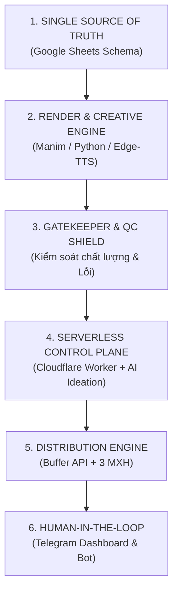

# 🚀 CẨM NANG KHỞI ĐỘNG DỰ ÁN TỰ ĐỘNG HÓA CHUẨN IT ARCHITECT
## Dành cho Nhà Sáng Tạo & Người Vận Hành Hệ Thống (Non-Tech / Vibe-Coding Framework)

---

## 💡 TRIẾT LÝ: TẠI SAO PHẢI CÓ FRAMEWORK?
Khi làm việc với AI bằng phương pháp "Vibe Coding" (lập trình theo cảm xúc/nhu cầu tức thời), vấn đề lớn nhất là:
* **Dễ bị rối luồng**: Khi sửa chỗ này thì lại phát sinh lỗi chỗ khác.
* **Mất thời gian sửa đi sửa lại (Refactoring)** vì không có khung chuẩn ngay từ đầu.
* **Lộ lọt thông tin bảo mật (API keys, Tokens)** do chưa phân vùng dữ liệu rõ ràng.

Một **IT Solution Architect** chuyên nghiệp khi bắt đầu một dự án tự động hóa sáng tạo nội dung (Content Automation) sẽ luôn chia dự án thành **6 Trụ Cột Độc Lập** sau:

---

## 🛠️ QUY TRÌNH 6 BƯỚC KHỞI TẠO MỘT DỰ ÁN MỚI TỪ CON SỐ 0

### BƯỚC 1: XÂY DỰNG CƠ SỞ DỮ LIỆU (DATABASE TRÊN GOOGLE SHEETS)
> [!IMPORTANT]
> **Nguyên tắc:** Google Sheet là "Trái tim" của hệ thống (Single Source of Truth). Mọi trạng thái video, link tải, nội dung bài học đều phải lưu tại đây.

1. Tạo 1 Google Spreadsheet mới.
2. Tạo Tab chính (ví dụ: `english_quiz`, `french_quiz`, `chinese_hsk`).
3. Chuẩn hóa **16 Cột (A ➔ P)** bất biến:
   * **Cột A (ID):** Số thứ tự bài (1, 2, 3...)
   * **Cột B (Topic):** Tên chủ đề bài học
   * **Cột C (Level):** Trình độ (A1-C1 / HSK 1-6)
   * **Cột D (Status):** Vòng đời video (`Pending` ➔ `Video` ➔ `Ready` ➔ `Published` / `Failed`)
   * **Cột E ➔ I (Word 1 ➔ 5):** Nội dung 5 từ vựng (Định dạng chuẩn: `Từ | Phiên Âm | Nghĩa`)
   * **Cột J (Metadata):** Tiêu đề, mô tả YouTube Shorts, TikTok, Reels
   * **Cột K (Video_URL):** Link file video Google Drive
   * **Cột L, M, N (YT_Status, TT_Status, FB_Status):** Trạng thái đăng từng mạng xã hội
   * **Cột O (Created_At):** Thời gian tạo bài (theo giờ Việt Nam GMT+7)
   * **Cột P (Notes):** Ghi chú kỹ thuật, lỗi kiểm định của hệ thống

---

### BƯỚC 2: XÂY DỰNG CỖ MÁY RENDER (MANIM + EDGE-TTS)
Tách biệt hoàn toàn phần "Vẽ đồ họa" và "Âm thanh" thành các module độc lập:
1. **Âm thanh (`audio_generator.py`):**
   * Sử dụng `edge-tts` (miễn phí, chất lượng cao).
   * Lựa chọn giọng đọc theo ngôn ngữ (US/UK cho tiếng Anh, France cho tiếng Pháp, v.v.).
2. **Khung hình Bìa 0.75s (`00:00:00`):**
   * Luôn render ảnh bìa ở giây đầu tiên của video để YouTube Shorts, TikTok, Facebook tự động bắt làm Thumbnail lưới mà không cần up ảnh rời.
3. **Kích thước chuẩn:** 1080x1920 (Tỉ lệ dọc 9:16), 60 FPS, bố cục an toàn tránh che bởi nút Like/Share của TikTok.

---

### BƯỚC 3: THIẾT LẬP LỚP LÁ CHẮN KIỂM ĐỊNH (GATEKEEPER & AUTO-QC)
Hệ thống muốn chạy tự động 24/7 mà không làm hỏng kênh thì bắt buộc phải có **2 Cổng kiểm soát**:
1. **Pre-Render Gatekeeper (Trước khi render):**
   * Kiểm tra lỗi chính tả, độ dài nghĩa tiếng Việt (<= 30 ký tự để không tràn khung).
   * Phát hiện lỗi ➔ Đổi sang `Failed` và dừng ngay, không tiêu tốn tài nguyên render vô ích.
2. **Auto-QC Gatekeeper (Sau khi render):**
   * Kiểm tra file video `.mp4`: Đủ thời lượng, có âm thanh, khung hình 00:00 đạt chuẩn tương phản.
   * Đạt 100% ➔ Tự động nâng cấp trạng thái sang `Ready`.

---

### BƯỚC 4: XÂY DỰNG BỘ NÃO SERVERLESS (CLOUDFLARE WORKER)
Cloudflare Worker chạy 24/7 hoàn toàn miễn phí, đóng 4 vai trò:
1. **AI Ideation (Sinh ý tưởng):**
   * Cơ chế xoay vòng Key (Multi-Key Rotation) và chuyển giao lỗi (Failover): Google Gemini ➔ Agnes AI ➔ Cloudflare AI ➔ Kho từ vựng mẫu.
2. **Webhook Telegram Bot:** Tiếp nhận lệnh điều khiển của người dùng.
3. **Cron Triggers (Hẹn giờ 24/7):**
   * 01:00 Sáng: Sinh ý tưởng & kích hoạt render.
   * 07:00 & 13:00: Đăng video tự động.
   * 12:01 & 18:01: Gửi báo cáo Dashboard.
4. **Buffer Publisher:** Điều phối đăng bài đa nền tảng qua GraphQL API.

---

### BƯỚC 5: CỖ MÁY KẾT XUẤT ĐÁM MÂY (GITHUB ACTIONS)
* Toàn bộ việc render nặng (FFmpeg, Manim) đẩy lên GitHub Actions Runner (tiết kiệm điện và không phụ thuộc vào máy tính cá nhân).
* **Nguyên tắc an toàn:** Chỉ kích hoạt khi có lịch hẹn hoặc khi người dùng bấm nút duyệt/gõ lệnh trên Telegram (KHÔNG chạy trên mỗi lần `git push`).

---

### BƯỚC 6: AN TOÀN BẢO MẬT (ZERO-SECRET PRINCIPLE)
1. **File `.gitignore`:** Chặn toàn bộ file `.env`, `service_account.json`, `*.pem`, `*.key`, `*.token`.
2. **GitHub Secrets:** Lưu trữ Google Service Account JSON, OAuth Tokens.
3. **Cloudflare Secrets:** Lưu trữ `TELEGRAM_BOT_TOKEN`, `BUFFER_ACCESS_TOKEN`, `GEMINI_API_KEYS`.
4. **Tuyệt đối không bao giờ hardcode mã khóa vào file code `.js` hoặc `.py`.**

---

## 📊 BẢNG THEO DÕI VÒNG ĐỜI DỰ ÁN (PROJECT LIFECYCLE MATRIX)

| Giai Đoạn | Nền Tảng Chịu Trách Nhiệm | Trạng Thái Trên Sheet | Hành Động Kỹ Thuật |
| :--- | :--- | :---: | :--- |
| **1. Khởi tạo** | Cloudflare Worker + AI | `Pending` | AI sinh 5 từ vựng, tạo Metadata, lưu vào Sheet |
| **2. Tiền kiểm định** | Python Gatekeeper | `Pending` ➔ `Failed` | Quét độ dài, quy tắc chữ; chặn nếu vi phạm |
| **3. Kết xuất** | GitHub Actions + Manim | `Pending` ➔ `Video` | Render video dọc + Bìa 0.75s, tải lên Drive |
| **4. Hậu kiểm định** | Auto-QC Engine | `Video` ➔ `Ready` | Kiểm tra video MP4; tự động duyệt bài |
| **5. Xuất bản** | Cloudflare + Buffer API | `Ready` ➔ `Published` | Đăng đồng loạt YouTube Shorts, TikTok, Reels |
